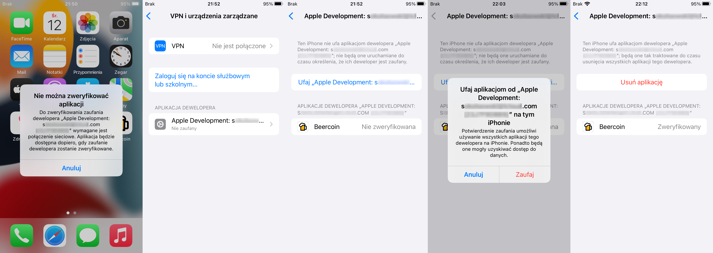

# BeerCoin


[](https://wakatime.com/badge/github/StudentBeerCoin/beercoin-app)

<a href='https://play.google.com/store/apps/details?id=xyz.beercoin.app'>
    
</a>

## Wymagania

### Android

- Windows/Linux/macOS
- Flutter SDK
- Android SDK (najlepiej z Android Studio)
- Java

### iOS

- macOS
- XCode
- Flutter
- CocoaPods
- Konto dewelopera (opcjonalnie)

**Uwaga:** w przypadku braku konta deweloperskiego, nie ma możliwości zainstalowania aplikacji na systemie iOS!

## Zanim zaczniesz

Przed zbudowaniem aplikacji należy pobrać zależności:

```bash
$ flutter pub get
```

## Budowanie aplikacji

By zbudować aplikację, należy skorzystać z polecenia `flutter build`:

### Android (plik APK)

```bash
$ flutter build apk --debug
```

**Uwaga:** by zbudować aplikację z wyłączonym debugowaniem, należy stworzyć klucz do podpisania aplikacji lub zmodyfikować plik `android/app/build.gradle`:

```gradle
buildTypes {
    release {
        signingConfig signingConfigs.debug
    }
}
```

### iOS

```bash
$ flutter build ios --debug
```

**Uwaga:** by zbudować aplikację dla iOS bez konta deweloperskiego, należy dodatkowo skorzystać z opcji `--no-codesign`.

## Uruchamianie aplikacji na urządzeniu

```bash
$ flutter run
```

Powyższe polecenie buduje w trybie `debug` aplikację dla podłączonego urządzenia, następnie ją instaluje i uruchamia.

**Uwaga:** w przypadku systemu iOS wymagane jest konto deweloperskie. Następnie, po zainstalowaniu aplikacji należy zatwierdzić nieznany certyfikat przechodząc do ustawień systemowych:

> Ustawienia > Ogólne > VPN i urządzenia zarządzane



Tam, w sekcji "Aplikacja dewelopera" znajduje się certyfikat aplikacji, oznaczony jako "nie zaufany". Po wejściu w szczegóły certyfikatu, należy kliknąć przycisk "Ufaj", by móc uruchomić samodzielnie podpisaną aplikację

**Uwaga:** by móc uruchomić aplikację na systemie iOS bez ponownej instalacji z poziomu komputera, należy zainstalować aplikację w trybie `release`, korzystając z opcji `--release`. W przeciwnym wypadku podczas próby uruchomienia aplikacji możemy otrzymać następujący komunikat:


---

Google Play i logo Google Play są znakami towarowymi firmy Google LLC.
